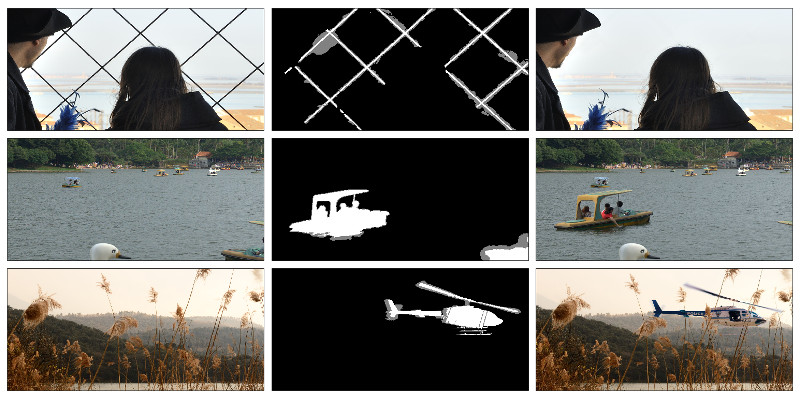

# Realistic Tampering Dataset

Version: **2.0 (1 Dec 2016)**
Contact: **Paweł Korus**, Shenzhen University and AGH University of Science and Technology
E-mail: pkorus [at] agh [dot] edu [dot] pl
Web: http://kt.agh.edu.pl/~korus
Github: https://github.com/pkorus/multiscale-prnu

## Description

This dataset contains 220 realistic forgeries created by hand in modern photo-editing software (GIMP and Affinity Photo) and covers various challenging tampering scenarios involving both object insertion and removal. The images were captured by four different cameras: Sony alpha57 (own dataset), Canon 60D (courtesy of dr Bin Li), Nikon D7000, Nikon D90 (RAISE dataset http://mmlab.disi.unitn.it/RAISE/).

All images are 1920 x 1080 px RGB uint8 bitmaps stored in the TIFF format. They were cropped from the middle of full-frame TIFF bitmaps obtained as follows:
- Sony A57 - camera RAW files were converted to TIFF using *dcraw* with default settings,
- Canon 60D - camera RAW files were converted to TIFF using original Canon software,
- Nikon D90 and D7000 - TIFF images were acquired directly from the RAISE dataset.

The dataset contains the following items:
- tampered images (1920 x 1080 px RGB unit8 TIFF)
- original images (1920 x 1080 px RGB unit8 TIFF)
- 3-level ground truth maps (1920 x 1080 px PNG)
- PRNU signatures obtained with the standard MLE estimator from DDE lab. (http://dde.binghamton.edu/download/camera_fingerprint/) (.MAT files)

The ground truth maps contain 3 labels: authentic areas (black), important semantic changes to the content (white) and collateral damage (gray). *Collateral damage* corresponds to pixels that have been changed with respect to the original image, but still represent roughly the same content. Such situation occurs when the tampered area is blended with the background (e.g., when the forger has used a larger brush for copy-move tampering) or when the background needed to be slightly changed to seamlessly accomodate the forgery.

The ground truth maps were obtained by manual refinement of automatically generated difference maps. Hence, while the authentic pixels' labels can be expected to be accurate, the distinction between tampered areas and collateral damage may be somewhat rough since:

 - manual refinement may be affected by subjective perception and labeling errors;
 - for some forgeries it may be impossible to precisely define the distinction.

For standard evaluation, both gray and white areas can be considered as tampered.

Note also that for object insertion cases, I followed a convention where shadows and reflections are treated as collateral damage, despite potentially considerable deviation from the original pixels.

Three example forgery cases are shown below: original image (left), ground truth (middle), tampered image (right).



The PRNU signatures were obtained from 200 favorable natural images (Nikon and Canon cameras) or from 90 out of focus flat images (Sony). The correlation predictors were trained on 25,000 image patches chosen randomly from 50 diverse natural images (separate images). All camera models were trained on TIFF images and contain PRNU presence / absence models for square analysis windows of size 32, 48, 64, 96, 128, 192, and 256 px.

## PRNU Analysis Toolbox

The dataset can be easily used in conjunction with our multi-scale analysis toolbox. You can obtain a copy as follows:

```
# git clone https://github.com/pkorus/multiscale-prnu
```

Once you have cloned the repository, you can easily download this dataset using:

```
# ./configure.py data:images
```

Image analysis functions provided by the toolbox will automatically be able to use the camera models from this dataset. Some helper functions for training / viewing / using the models are also available. For more information, please refer to the documentation of the toolbox.

## Using the Dataset

**The dataset can be used only for educational and research purposes.**

Originally, the dataset was created for realistic performance evaluation in our paper *"Multi-scale Analysis Strategies in PRNU-based Tampering Localization"* and contained fewer images. During subsequent studies, we have extended the dataset. For the sake of research reproducibility, a record of images used in each individual study is available for download at http://kt.agh.edu.pl/~korus.

If you use this dataset in your research, please cite the following papers:

- P. Korus & J. Huang, Multi-scale Analysis Strategies in PRNU-based Tampering Localization, IEEE Trans. Information Forensics & Security, 2017
- P. Korus & J. Huang, Evaluation of Random Field Models in Multi-modal Unsupervised Tampering Localization, Proc. of IEEE Int. Workshop on Inf. Forensics and Security, 2016

For Bibtex users:

```
@article{Korus2016TIFS,
  Author = {P. Korus and J. Huang},
  Journal = {IEEE Trans. on Information Forensics and Security},
  Title = {Multi-scale Analysis Strategies in PRNU-based Tampering Localization},
  Year = {2017}
}
```

```
@InProceedings{Korus2016WIFS,
  Title = {Evaluation of Random Field Models in Multi-modal Unsupervised Tampering Localization},
  Author = {P. Korus and J. Huang},
  Booktitle = {Proc. of IEEE Int. Workshop on Inf. Forensics and Security},
  Year = {2016}
}
```
