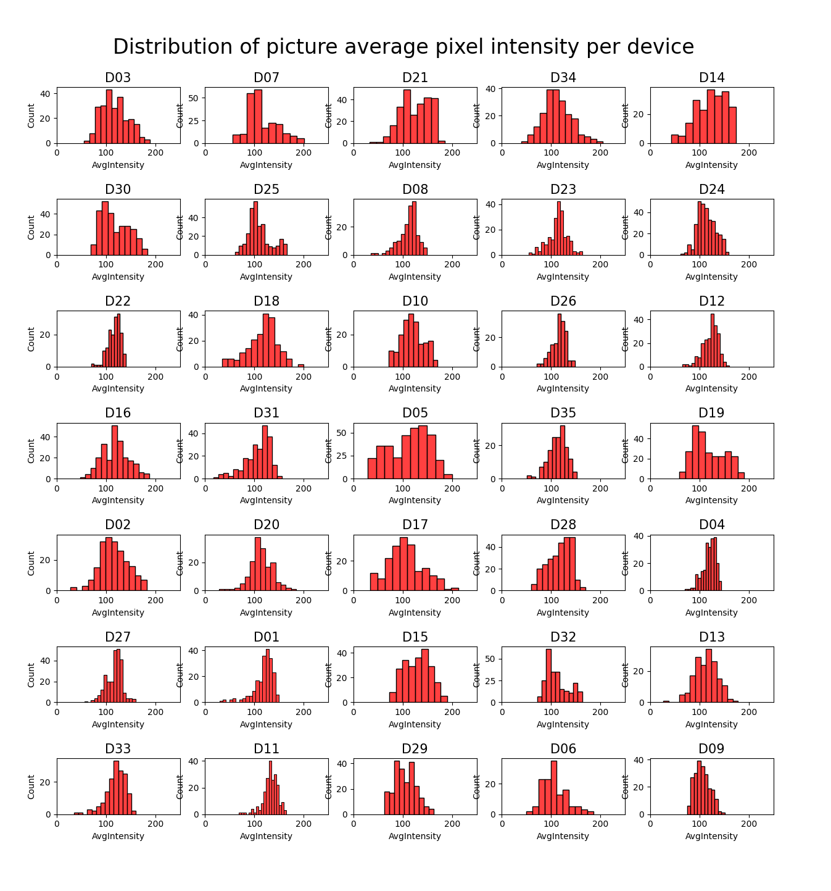

<!-- set knitr options here -->

```{r setup, include=FALSE}
#Sys.setlocale("LC_TIME", "en_US.UTF-8")
knitr::opts_chunk$set(echo = TRUE)
```

<!-- main body starts here -->

\pagebreak


# 1. Introduction {#intro}

In recent years, the field of digital forensics has witnessed a growing reliance on Photo Response Non-Uniformity (PRNU) as a powerful tool for camera identification and authentication. PRNU serves as a unique fingerprint embedded in the images captured by a camera, arising from imperfections in the camera sensor. This distinct signature has proven to be a valuable forensic tool, aiding in the verification of image authenticity and the identification of source devices.

In the context of digital forensics, understanding the robustness of PRNU signatures is crucial. This master's thesis aims to investigate the resilience of PRNU camera signatures under various image manipulations and transformations. The study leverages the VISION dataset, a comprehensive collection comprising flatfield and natural images from a diverse set of 31 camera devices. Through systematic experimentation, we will explore the impact of different image alterations on the reliability and stability of PRNU signatures.

The experimental setup involves applying a range of image manipulations that simulate popular media filters commonly used on social media platforms. These manipulations include adjustments to image enhancing, saturation, brightness, and contrast. Furthermore, the study delves into the realm of generative images through the application of a Style Transfer processor. Style Transfer introduces a unique challenge to the robustness of PRNU, as it involves the transformation of images to adopt the artistic style of another.

The overarching goal is to evaluate how well PRNU signatures can withstand these alterations and transformations, shedding light on the limits and vulnerabilities of this forensic tool. By simulating real-world scenarios where images undergo common post-processing steps, we aim to provide insights that contribute to the enhancement of PRNU-based camera identification methodologies.

Through this research, we anticipate contributing valuable knowledge to the digital forensics community, helping forensic investigators and researchers better understand the potential challenges and limitations associated with PRNU signatures in an ever-evolving digital landscape.

## 1.0 Main challenges

One of the primary challenges in this project is the inherently computational nature of the experiments. The complexity arises from the need to process large images without compromising the integrity of the PRNU signature. Resizing, a common optimization strategy, is ruled out. Instead, to preserve the entirety of the camera signature, experiments involve carefully cropping images to obtain representative portions of the PRNU pattern, often focusing on central areas.

In the quest for meaningful results, the processor has tirelessly executed experiments, both on a personal computer and on the _Google Colab_ platform. The sheer volume of experiments, combined with the intricate nature of each trial, has translated into hundreds of hours of computation on home systems. Additionally, the _Google Colab_ platform, known for its resourcefulness in handling computational tasks, has seen the expenditure of approximately 300 computational units.

## 1.1 Main concepts

### 1.1.1 PRNU

*Pixel output*

Considering the impact of manufacturing defects coming from the wafer silicon a sensor is made of, the raw output of a sensor can be expressed as:
$$
Y = I + IK + \tau D + c + \theta
$$
Where $\tau$ is a scalar multiplicative factor whose value is determined by exposure, temperature, and ISO Settings. The matrix c is the matrix of offsets and the dark current factor D is a noise-like signal due to leakage of electrons into pixels' electron wells. $K$ is the PRNU factor. The modeling noise $\theta$ is a collection of all other noise sources, which are mostly random in nature and therefore difficult to use for forensic purposes (readout noise, shot noise, also known as photonic noise, quantization noise, etc.). For spike pixel defects, such as hot or stuck pixels, at least one of the three parameters, $K, D$ and $c$ , becomes large. Even though the parameters could be accurately estimated by taking special test pictures, such as pictures of dark scenes with long exposure, in forensic setting the camera may not be available and the challenge becomes to estimate these three matrices from the limited set of images available to the analyst. We also need to design an estimator for the onset of a defect and an estimator for the acquisition time of an unknown image by detecting it in the presence of defects.

Photo Response Non-Uniformity (PRNU) is a fundamental characteristic inherent to individual image sensors, arising from imperfections and variations during the manufacturing process. It manifests as a unique noise pattern that is present in the output of each sensor pixel when exposed to the same uniform illumination. PRNU is mainly attributed to variations in pixel sensitivity, dark current, and other sensor-specific factors. This noise pattern can be considered akin to a "fingerprint" for the camera sensor and is often treated as a quasi-unique identifier for digital images. PRNU has found significant applications in the field of digital image forensics, where it is employed for source camera identification and authenticity verification. By analyzing the PRNU noise pattern extracted from a given image, experts can determine the camera that captured the image, facilitating the identification of image origins, tampering detection, and even establishing the credibility of digital evidence in legal cases. The ability of PRNU to reveal subtle sensor-specific noise characteristics has revolutionized the field of multimedia forensics, playing a pivotal role in ensuring the integrity and traceability of digital imagery.


$$
\text{PRNU}(\mathbf{I}) = \frac{\mathbf{I} - \mathbf{K} \odot \mathbf{I}}{\mathbf{K} \odot \mathbf{I}}
$$
The normalized correlation:
$$
\text{corr}(\mathbf{X,Y}) = \frac     {\mathbf{(X-\bar{X})}  \odot \mathbf{(Y-\bar{Y})}}      {\mathbf{||X-\bar{X}||} \odot \mathbf{||Y-\bar{Y}||} }
$$
FOr an image I obtained by a digitarl camera, its noise residual is defined as $W_{\text{I}} = I - F(I)$, where $F$ is a denoising filter. THe major component of the sensor fingerprint is due to photo-response non-uniformity (PRNU), Which can be captured using a multiplicative factor $K$ (the sensor _fingerprint_). Using the model, the noise residual can be written as:
$$
W_{\text{I}} = aIK + \theta
$$
Where $\theta$ stands for all other random noise components, such as the shot noise or the redout noise, and $a$ is an attenuation factor of the same dimension as $K$ that, in general, depends on the image content. 

The maximum likelihood estimator of the PRNU factor $K$ from images $I^{I}, ... , I^{N}$ has the form:
$$
\hat{K} = \frac{\sum_{\text{i=1}}^{\text{N}}W_{\text{I}}^{\text{(i)}}I^{\text{(i)}}}{\sum(I^{\text{(i)}})^{\text{2}}}
$$

Under the assumption that no geometric transform was applied to image $J$ (cropping, scaling, and digital zooming), the presence of the camera fingerprint represented by an estimate $\hat{K}$ is established through the correlation detector:
$$
\rho = corr({W_{\text{J}}}, J\hat{K})
$$

### 1.1.2 PSNR

Peak Signal-to-Noise Ratio (PSNR) is a fundamental image quality metric used to assess the fidelity of a reconstructed or compressed image when compared to its original, reference image. PSNR quantifies the level of distortion or noise introduced during the image compression or transmission process and is widely employed in various fields such as image processing, computer vision, and multimedia technology.

Mathematically, PSNR is calculated as the ratio of the peak signal power (which represents the maximum possible pixel value of the image) to the mean squared error (MSE) between the original and the reconstructed images. The formula for PSNR is typically expressed in decibels (dB):

### 1.1.3 Flatfield and natural images

**Flatfield Images**
Flatfield images, also known as flat-field calibration images or flat frames, are images taken with a uniform source of light, covering the entire field of view of a camera or imaging device. The purpose of flatfield images is to account for variations in sensitivity and other imperfections across the sensor or detector of the imaging device. These variations can result from differences in pixel response, lens vignetting, and dust or artifacts on the sensor's surface. By dividing the actual image by a flatfield image, these variations can be corrected, resulting in more accurate and consistent image data.

**Natural Images**
Natural images refer to photographs or visual representations of real-world scenes or objects taken under natural lighting conditions. These images are not artificially manipulated or generated, but rather capture the visual information as it appears in the environment. Natural images are used in various applications, including photography, scientific imaging, computer vision, and machine learning. The complexity and diversity of natural scenes pose challenges for image analysis algorithms due to factors like lighting variations, occlusions, textures, and object shapes.

In the context of digital image forensics or PRNU analysis, flatfield and natural images can play a role in understanding the characteristics of images and their underlying noise patterns. PRNU, or Photo Response Non-Uniformity, refers to the unique noise pattern introduced by the imaging sensor of a camera. Analyzing PRNU involves differentiating between variations caused by the camera sensor and the natural variations present in a scene, and this analysis can benefit from understanding both flatfield and natural images.

$$
\text{PSNR} = 10 \cdot \log_{10} \left( \frac{\text{Peak Signal Power}}{\text{MSE}} \right)
$$


In this equation, a higher PSNR value indicates better image quality, as it signifies a lower amount of distortion or noise present in the reconstructed image compared to the reference image. Conversely, a lower PSNR value suggests higher distortion levels and reduced fidelity.

During the course of my research, I have utilized PSNR as an objective measure to evaluate the performance of various image compression techniques, algorithms, or models that I have implemented. By calculating and analyzing the PSNR values, I am able to assess the effectiveness of different approaches in maintaining image quality while achieving compression or processing goals.

In summary, Peak Signal-to-Noise Ratio (PSNR) is a vital metric in that allows to quantitatively evaluate the quality of reconstructed or processed images. By understanding and applying PSNR calculations, I can make informed decisions about the performance of my implemented methods and their impact on image fidelity.

\pagebreak

# 2. Literature Review and Related Work
The study of image forensics has led to various methods for detecting image manipulations. Notably, PRNU-based techniques have gained attention for their effectiveness in identifying tampered images. PRNU patterns, which capture unique sensor-specific noise in images, offer valuable insights for image authenticity verification. This project builds upon these concepts and explores novel approaches to PRNU-based forgery detection.

\pagebreak

# 3. Description of the Task and Dataset

During the examination of the VISION dataset, we aimed to determine whether photos from various cameras exhibited distinct characteristics. This investigation was crucial to ensure that our experiments maintained fairness and weren't skewed towards specific devices.

Our Exploratory Data Analysis (EDA) delved into the distribution of pixel intensities across the dataset. The findings revealed a consistent set of characteristics, irrespective of the camera source. This statistical uniformity assures us that, statistically speaking, the choice of a particular device won't significantly influence our experiments.

By establishing a well-balanced representation in our dataset, we not only enhance the reliability of our experiments but also strive to maintain fairness and impartiality in our investigations.

{width=75% style="margin-bottom: -20px;"}

\pagebreak

# 4. Methodology

## 4.1 The workloads system database & manager

Recognizing the challenges of extended computational tasks and the need for a robust and efficient system, a dedicated workload management framework was created to orchestrate and streamline the experimental process. One cannot afford setting off a large sequence of tests to run overnight, to be collected the morning after, to find that the sequence had failed soon after being started. In order to efficiently handle and iterate through issues arising during the experiments, a workload system was created, so the work can be handled, distributed and iterated in an efficient manner. The workload database is just a simple collection of json data, where each file serves as a directive, containing instructions for individual experiments. The workload manager takes charge, parsing these files, orchestrating the execution of experiments, and recording outcomes in concise summaries. Successful experiments are stored in a SQLite local database, whilst others resulting in error are properly labeled and set aside, so they can be studied and resolved later. This procedure avoids interruptions and optimize the limited computational time we can afford.

\pagebreak

# 5. Experimental Setting
To evaluate the effectiveness of our PRNU-based approach, we conducted comprehensive experiments using the benchmark dataset. Training parameters, data augmentation techniques, and evaluation metrics are defined in this section. We outline the training strategies and discuss how our method performs across various manipulation scenarios.

\pagebreak

# 6. Results
Our experimental results demonstrate the efficacy of our PRNU-based approach in detecting manipulated images. We provide a detailed analysis of detection accuracy for different types of manipulations, showcasing the strengths and limitations of our method. The results highlight the potential of PRNU-based techniques to contribute significantly to the field of image forensics.

\pagebreak

# 7. Analysis
In this section, we delve into a thorough analysis of the experimental results. We discuss the performance of our approach across different manipulation scenarios and provide insights into the factors influencing its accuracy. Additionally, we compare our method with existing techniques, emphasizing its advantages in terms of detection rates and computational efficiency.

\pagebreak

# 8. Conclusion and Future Work
The project concludes by summarizing the contributions and outcomes of our work. We discuss the significance of our PRNU-based approach in the context of image forensics and its potential to ensure the authenticity and integrity of digital images. As future work, we propose investigating advanced architectures, exploring adversarial training, and extending the method to video forensics.

By harnessing the power of PRNU patterns, this project advances the field of image manipulation detection and enhances our ability to detect tampered images. Our approach holds promise for a range of applications that require the verification and authentication of digital visual content.
\pagebreak

# Appendix 1
## Additional visualizations from exploratory data analysis

\pagebreak

# Citations 


