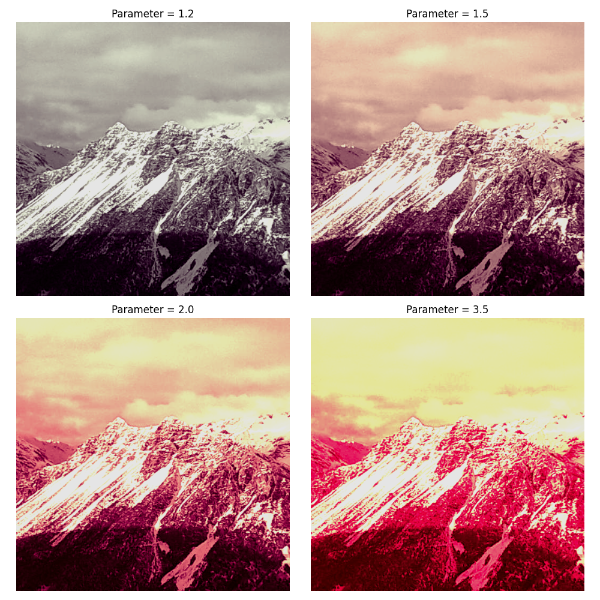

<!-- set knitr options here -->

```{r setup, include=FALSE}
#Sys.setlocale("LC_TIME", "en_US.UTF-8")
knitr::opts_chunk$set(echo = TRUE)
```

<!-- main body starts here -->

\pagebreak


# 1. Introduction {#intro}

In recent years, the field of digital forensics has seen a growing reliance on Photo Response Non-Uniformity (PRNU) as a powerful tool for camera identification and authentication. PRNU serves as a unique fingerprint embedded in the images captured by a camera, arising from imperfections in the camera sensor. This distinct signature has proven to be a valuable forensic tool, aiding in the verification of image authenticity and the identification of source devices.

In the context of digital forensics, understanding the robustness of PRNU signatures is crucial. This master's thesis aims to investigate the resilience of PRNU camera signatures under various image manipulations and transformations. The study leverages the VISION dataset, a comprehensive collection comprising flatfield and natural images from a diverse set of 31 camera devices. Through systematic experimentation, we will explore the impact of different image alterations on the reliability and stability of PRNU signatures.

The experimental setup involves applying a range of image manipulations that simulate popular media filters commonly used on social media platforms. These manipulations include adjustments to image enhancing, saturation, brightness, and contrast. Furthermore, the study looks into the realm of generative images through the application of a Style Transfer processor. Style Transfer introduces a unique challenge to the robustness of PRNU, as it involves the transformation of images to adopt the artistic style of another.

The overarching goal is to evaluate how well PRNU signatures can withstand these alterations and transformations, shedding light on the limits and vulnerabilities of this forensic tool. By simulating real-world scenarios where images undergo common post-processing steps, we aim to provide insights that contribute to the enhancement of PRNU-based camera identification methodologies.

We anticipate a humble contribution of knowledge to the digital forensics community, helping forensic investigators and researchers better understand the potential challenges and limitations associated with PRNU signatures in the digital landscape.

## 1.0 Main challenges

One of the primary challenges in this project is the expensive demand of the experiments in terms of computer resources. The complexity comes from the need to process large images without compromising the integrity of the PRNU signature. Resizing, a common optimization strategy, is ruled out. Instead, to preserve the entirety of the camera signature, experiments involve carefully cropping images to obtain representative portions of the PRNU pattern, often focusing on central areas.

In the quest for meaningful results, the processor has tirelessly executed experiments, both on a personal computer and on the _Google Colab_[^1] platform. The high volume of experiments, combined with the demanding nature of each trial, has resulted into hundreds of hours of computation on home systems. Additionally, the _Google Colab_ platform, known for its resourcefulness in handling computational tasks, has seen the expenditure of more than 300 computational units.

The features of the home computer used in these experiments are as follows: Board: Gigabyte Technology Co., Ltd. B550M AORUS ELITE. Memory: 16,0 GiB Graphics: AMD® Radeon rx 6600 CPU: AMD® Ryzen 5 5500 × 12 Disk: 2,1TB System: Ubuntu 22.04 LTS

[^1]: https://colab.research.google.com/

### Main goal

In this work, we want to use a classic approach for camera identification using the PRNU strategy and applying PCE [@large_scale] to enhance the 2D correlation during the matching. Everything is described below. But we will be working with picture manipulations that mimic simulate enhancing filters that are commonly used in social media platforms. The scope is to see how the classification behaves when strong filters are applied to the natural pictures due to degradation of the signatures in the images following the manipulations.
All the code from this work is available at the personal github repository: https://github.com/jm20389/mat099

### The _VISION_ dataset

Originally presented in [@vision], the _VISION_ dataset is composed by 34,427 images and 1914 videos, both in the native format and in their social version (Facebook, YouTube, and WhatsApp are considered), from 35 portable devices of 11 major brands. VISION can be exploited as benchmark for the exhaustive evaluation of several image and video forensic tools.
For the current project, we analyzed picture intensity from the pictures on each device to assess that the features and characteristics are evenly distributed. In the majority of our test, a small subset of 3 devices were used, given the resources in time and computer power we can afford. The pictures from our tests are also transformed as described earlier.

## 1.1 Main concepts

### 1.1.1 PRNU

[@multimedia_forensics] explains how every imaging sensor introduces a certain amount of noise to the images it captures slight fluctuations in the intensity of individual pixels even when the sensor plane was lit absolutely homogeneously. One of the breakthrough discoveries in multimedia forensics is that photo-response non-uniformity (PRNU), a multiplicative noise component caused by inevitable variations in the manufacturing process of sensor elements, is essentially a sensor fingerprint that can be estimated from and detected in arbitrary images. [@hany_farid] describes how image forensics take advantage of manufacturing imperfections coming from the silicon wafer photo detectors consist of. When the sensor is exposed to light, the stray electrons combine with those generated by the photo detector, causing slight variations in the final pixel values. 

Handling pixel noise is far from easy because the noise varies randomly from pixel to pixel in the image. Because sensor noise sums with the photo detector signal, it can be modeled with a pixel-wise additive modulation. Imagine that we point our camera at a perfectly uniform gray wall. A noise-free sensor will record an image with the same value at each pixel. Let’s say that this pixel value is 3 The ISO governs the sensitivity of the sensor. In low light conditions, a high ISO is used to make the sensor more sensitive to small amounts of light. Stray electrons and other sources of sensor noise modulate the value of each pixel by adding a small positive or negative value to 128. From pixel to pixel, the amount of modulation varies randomly with a range that depends on temperature, exposure, and ISO. Because these factors can vary across images, the modulation range typically varies from image to image. These factors do not vary within an image, however, so the overall level of noise should be the same throughout an authentic image. When creating a photo composite, it is common to combine multiple images. If the sensor noise in these source images is not the same, the level of noise in the composite will vary across space. Re-sizing, sharpening, or blurring a region within an image may also create variation in the level of noise across space.

*Pixel output*

[@original] considers the impact of manufacturing defects coming from the wafer silicon a sensor is made of, the raw output of a sensor can be expressed as:
$$
Y = I + IK + \tau D + c + \theta
$$
Where $\tau$ is a scalar multiplicative factor whose value is determined by exposure, temperature, and ISO Settings. The matrix c is the matrix of offsets and the dark current factor D is a noise-like signal due to leakage of electrons into pixels' electron wells. $K$ is the PRNU factor. The modeling noise $\theta$ is a collection of all other noise sources, which are mostly random in nature and therefore difficult to use for forensic purposes (readout noise, shot noise, also known as photonic noise, quantization noise, etc.). For spike pixel defects, such as hot or stuck pixels, at least one of the three parameters, $K, D$ and $c$ , becomes large. Even though the parameters could be accurately estimated by taking special test pictures, such as pictures of dark scenes with long exposure, in forensic setting the camera may not be available and the challenge becomes to estimate these three matrices from the limited set of images available to the analyst. We also need to design an estimator for the onset of a defect and an estimator for the acquisition time of an unknown image by detecting it in the presence of defects.

PRNU is mainly attributed to variations in pixel sensitivity, dark current, and other sensor-specific factors. This noise pattern can be considered akin to a "fingerprint" for the camera sensor and is often treated as a quasi-unique identifier for digital images. PRNU has found significant applications in the field of digital image forensics, where it is employed for source camera identification and authenticity verification. By analyzing the PRNU noise pattern extracted from a given image, experts can determine the camera that captured the image, facilitating the identification of image origins, tampering detection, and even establishing the credibility of digital evidence in legal cases. The ability of PRNU to reveal subtle sensor-specific noise characteristics has revolutionized the field of multimedia forensics, playing a pivotal role in ensuring the integrity and traceability of digital imagery.

$$
\text{PRNU}(\mathbf{I}) = \frac{\mathbf{I} - \mathbf{K} \odot \mathbf{I}}{\mathbf{K} \odot \mathbf{I}}
$$

The normalized correlation:
$$
\text{corr}(\mathbf{X,Y}) = \frac     {\mathbf{(X-\bar{X})}  \odot \mathbf{(Y-\bar{Y})}}      {\mathbf{||X-\bar{X}||} \odot \mathbf{||Y-\bar{Y}||} }
$$

For an image I obtained by a digital camera, its *noise residual* is defined as $W_{\text{I}} = I - F(I)$, where $F$ is a _denoising filter_. The major component of the sensor fingerprint is due to photo-response non-uniformity (PRNU), Which can be captured using a multiplicative factor $K$ (the sensor _fingerprint_). Using the model, the noise residual can be written as:

$$
W_{\text{I}} = aIK + \theta
$$

Where $\theta$ stands for all other random noise components, such as the shot noise or the redout noise, and $a$ is an attenuation factor of the same dimension as $K$ that, in general, depends on the image content. 

We compute the noise residual r and suppress most of the scene content by subtracting a denoised version of the image itself: 
$$
r = y - f (y) = y - \hat{X}
$$

where $f$ denotes a denoising algorith. [@handbook] notes that even in the best case, with perfect denoising, $\hat{X}=x$ the remaining noise term is likely to dominate r which, therefore, will be only weakly correlated with the camera PRNU. In the presence of textured areas, however, denoising is typically less accurate and some signal components leak into the residual contributing to reducing the operative SNR, to the point of making detection virtually impossible. Especially in these areas, the effectiveness of the denoising algorithm becomes crucial for the overall performance.

{width=80%}

The maximum likelihood estimator of the PRNU factor $K$ from images $I^{I}, ... , I^{N}$ has the form:

$$
\hat{K} = \frac{\sum_{\text{i=1}}^{\text{N}}W_{\text{I}}^{\text{(i)}}I^{\text{(i)}}}{\sum(I^{\text{(i)}})^{\text{2}}}
$$

Under the assumption that no geometric transform was applied to image $J$ (cropping, scaling, and digital zooming), the presence of the camera fingerprint represented by an estimate $\hat{K}$ is established through the correlation detector:
$$
\rho = corr({W_{\text{J}}}, J\hat{K})
$$

### 1.1.2 PCE

We've just assumed no geometric transforms, however this is rarely the case when dealing with pictures from different sources and environments. In [@large_scale] the PCE is used to overcome these challenges and help with the correlation process to peform camera attribution. We describe this below.

#### 1.1.2.1 Cross-correlation functions:

In the code, we use the following approaches to calculate the cross correlation:

- _crosscorr_2d_ 
The function begins by normalizing both matrices by subtracting their mean and pads them with zeros to match the maximum height and width. The next step involves applying 2D Fast Fourier Transform to both normalized and padded matrices. The function proceeds by computing the element-wise multiplication of the FFTs of k1 and k2 and then applies the inverse FFT. Finally, it returns the real part of the result as a 2D matrix of the same size as the input matrices.

- _aligned_cc Function_
Aligned cross-correlation is a technique used to compare two sets of PRNU fingerprints while compensating for *potential misalignment* between them. Because of external or undesired factors like rotation, scaling, or translation... the fingerprints may not align perfectly. Aligned cross-correlation tries to find the best alignment between two sets of PRNU fingerprints before computing the cross-correlation.

The function calculates the L2 norm (Euclidean norm) for each row in k1 and k2 for normalization. Then, transposing k2 for efficient matrix multiplication, calculating the cross-correlation matrix (cc), and eventually computing the normalized cross-correlation matrix (ncc) by dividing cc by the outer product of the L2 norms of k1 and k2. 

The final output is a dictionary containing the cross-correlation matrix (cc) and the normalized cross-correlation matrix (ncc).

#### 1.1.2.2 PCE

It is important to use a good comparison method to detect similarities between the different patterns extracted. [@large_scale] is a well known study in the field of PRNU analysis where the *PCE* metric is used. In particular it is used for a large scale identification. The paper presents a large scale test of camera identification from sensor fingerprints, using pictures from _Flickr_[^2], an existing on-line image sharing site. One million images are tested spanning 6896 individual cameras covering 150 models, providing practical estimates of false acceptance and false rejection rates. They use the _Neyman-Pearson criterion_ to set false acceptance probability and the test statistics PCE exhibited significantly thicker tails when compared to theoretical models.

Our test and main method to perform camera attribution using PRNU will rely on the *PCE (Peak-to-Correlation Energy)*. It is a metric used to evaluate the significance of a peak in a cross-correlation map. This parameter is calculated by correlating two images (complete correlation for all possible displacements) and dividing the energy (squared value) in the maximum by the average energy calculated after "removing" the peak surroundings. The PCE is calculated as the ratio of the squared peak height to the correlation energy in the surrounding area, excluding a neighborhood around the peak. Mathematically, it is defined as: $\text{PCE} = \frac{\text{Peak}^2}{\text{Energy in the Surrounding Area}}$

[^2]: https://www.flickr.com/

#### 1.1.2.3 Final statistics

In the end, we are performing a binary classification, as the goal is to say whether a picture belongs to a certain device or not. The _stats_ function takes two main inputs: a cross-correlation matrix (cc) and a boolean multidimensional array representing ground truth (gt). The gt array indicates the true positive and true negative classifications, this is calculated in a separated helper within the class. The final metric for the test is simple: to assess the effectiveness of the classification method, in other words, to see whether the pictures are correctly associated to their source device.

We flatten both the gt and cc arrays to prepare for *ROC* assessment(Receiver Operating Characteristic (ROC) using the _roc_curve_ function from scikit-learn. This is the trade-off between the true positive rate (sensitivity) and the false positive rate (1 - specificity) for different threshold values.

Alongside the ROC metric, the Area Under the Curve *AUC* is calculated using the _auc_ function from scikit-learn as well. The AUC score serves as a quantitative measure of the classifier's ability to separate between positive and negative examples, ranging from 0 to 1.

We also determine the Equal Error Rate *EER*, this is the point on the ROC curve where false positives equal false negatives. This is achieved by identifying the index where the squared difference between the false positive rate (FPR) and (1 - true positive rate) is minimized.

Finally, the computed statistics, including True Positive Rate (tpr), False Positive Rate (fpr), Threshold values (th), AUC score (auc), and Equal Error Rate (eer), are put together into an output dictionary (outdict). This dictionary provides a comprehensive set of metrics for evaluating the performance of the binary classification system represented by the input cross-correlation or normalized cross-correlation matrix.


### 1.1.3 Flatfield and natural images

**Flatfield Images**
Flatfield images, also known as _flat-field calibration images_ or _flat frames_, are images taken with a stable and uniform source of light, covering the entire field of view of a camera. This is to account for variations in sensitivity and other imperfections across the sensor or detector of the camera device. These variations may come from differences in pixel response, lens vignetting, and dust or artifacts on the sensor's surface. By dividing the actual image by a flatfield image, these variations can be corrected, resulting in more accurate and consistent image data.

**Natural Images**
On the contrary _Natural_ images refer to photographs or visual representations of real-world scenes or objects taken under natural lighting conditions. These images are not artificially manipulated or generated, but rather capture the visual information as it appears in the environment. Natural images are used in various applications, including photography, scientific imaging, computer vision, and machine learning. The complexity and diversity of natural scenes pose challenges for image analysis algorithms due to factors like lighting variations, occlusions, textures, and object shapes.

In our project, from the VISION dataset, for each camera device we have two sets, one made of flatfield images, and another with natural images. We stract the fingerprints using the set of flatfield pictures. Due to resources limitations, images are cropped to a squared area of 512, repeating this procedure for all tests for consistency. The fingerprints are stored as python objects using the pickle module, in this way we can handle a "fingerprint database" to avoid calculating the flatfield fingerprints from each device on each test.

{width=80%}

### 1.1.3 Style Transfer

Our interest in studying style transfer comes from the recent popularity in social media to use this technique as a picture "enhancing" filter. Therefore we wish to incorporate this option as another image filter we can perform tests with. The "Neural style transfer" is an optimization technique that is used to take two pictures, one being the target picture to apply the effect (content) and another picture that will represent the artistic effect we want to impersonate (style picture, such as an artwork from a famous painter)—and blend them together so the output image looks like the content image, but with the style from the style reference image. *We have not used external sources to generate the style transfer pictures*, but instead, we have developed our own style transfer picture generator module, which can be parameterized, _StyleTransferProcessor.py_ . The Style Transfer Processor module is compatible with the rest of the framework, being inherited by the upper class _ImageProcessor.py_, so that the Image Processor can handle these transformations on the fly, same as with the rest of transformations, creating a picture in memory and forwarding it to the later PRNU Processor, saving time, energy and memory. We have developed our Style Transfer Processor following the guidelines from TensorFlow[^4]

_VGG-19_[^3] is a known convolutional neural network whose structure contains 19 layers, a pretrained network architecture. In this project we only use a few layers from the model, for example discarding the ones used for classification purposes, as those are not useful for the style transfer task, whilst we select the ones that extract features that are useful to mimic the artistic style from the style picture source. These are the intermediate layers of the model that get the content and style representations of the image. Starting from the network's input layer, the first few layer activations represent low-level features, such as: edges, textures, appearance... As one keeps going through the network, the final layers represent higher-level features like objects or body parts. These intermediate layers are necessary to define the representation of content and style from the images. Given an input image, we try to match the corresponding style and content target representations at these intermediate layers.

[^3]: https://keras.io/api/applications/vgg/

For a neural network to perform image classification (which this VGG19 model has been trained to do), it must understand the image. This requires taking the raw image as input pixels and building an internal representation that converts the raw image pixels into a complex understanding of the features present within the image. This is also a reason why CNN's are able to generalize well: they’re able to capture the singularities and defining features within classes that are agnostic to background noise and other nuisances. Thus, somewhere between where the raw image is fed into the model and the output classification label, the model serves as a complex feature extractor. By accessing intermediate layers of the model, we are able to describe the content and style of input images.

The content of an image is represented by the values of the intermediate feature maps. The style of an image can be described by the means and correlations across the different feature maps. We calculate a *Gram matrix*[^4] that includes this information by taking the outer product of the feature vector with itself at each location, and averaging that outer product over all locations. This Gram matrix can be calculated for a particular layer as:

$$
G_{cd}^{l} = \frac{\sum_{i,j}{F_{ijc}^{l}(x)}\sum_{i,j}{F_{ijd}^{l}(x)}}{IJ}
$$

In our code, we implement the above using _tf.linalg.einsum_.

To extract style and content, we build a model that returns the aforementioned as tensors, the class _StyleContentModel_.This model returns the gram matrix (style) of the style_layers and content of the content_layers. Finally after having the style and content extractor, we implement the style transfer algorithm. Do this by calculating the mean square error for your image's output relative to each target, then take the weighted sum of these losses.

The weights of the style and content sources come to play into the _style_content_loss_ function. The function computes the total loss for style transfer combining both the style loss and content loss. The loss is calculated based on the differences between the features of the generated image and the target style and content images. The total loss is the sum of the scaled style loss and the scaled content loss. The weights and scaling factors allow us to control the impact of style and content in the output generated image.

{width=100%}
[^4]: https://www.tensorflow.org/tutorials/generative/style_transfer

\pagebreak

# 2. Literature Review and Related Work
The strong interest on PRNU in the field of image forensics comes from its effectiveness in detecting image manipulations and tampering. They offer valuable insights for image authenticity verification. However the field has evolved and multiple research resources have been invested in these techniques.

[@original] is a good starting point for any researcher in these field, this article sets one of the first precedents in using PRNU for camera attribution, in a test with 320 using what is nowadays a classical approach using a denoising filter and studying the pixel correlation. Soon after, the most evident issues are faced, such as cropped, resized pictures, etc. [@cropped_scaled] proves that the challenge can be solved using the peak-to-correlation technique PCE is a measure that quantifies the significance of the peak in a correlation map produced by comparing two images or signals, nowadays is commonly used in the analysis of cross-correlation maps, where a high peak indicates a strong correlation between the test image and a reference or template image, because a higher PCE value indicates a more reliable and significant detection of the manipulated region. The results indicate that a reliable camera ID is possible for images linearly scaled down by a factor of 0.5 or more or images with 90% or more cropped away.

Fingerprint databases are interesting for digital media forensic investigators, having a large database of fingerprints that could be shared for an universal device identification is soon pursued. It has already been used in court to provide evidence in prosecution whenever a crime has been committed by taking a digital picture. In [@large_database] it is described a fast search algorithm whose worst-case complexity is still proportional to the database size but does not depend on the sensor resolution. 

It is not a surprise for counter-forensic techniques to arise. In [@counter] a "triangle attack" is simulated. An adversary may attempt to fool the identification algorithm by pasting a camera fingerprint onto an image that did not come from the camera. In doing so, an innocent victim would be framed. Techniques are investigated that the victim may use to prove that the fingerprint was not inserted during the image acquisition, as the adversary claims, but was later maliciously added.

Instead of impersonating, it has been tried to just simply remove the fingerprint, to make this harder for the forensics. In [@anonymization] an improvement on the existing adaptive PRNU denoising method against source camera identification is introduced. The main objective of image source anonymization is to protect the identity of the photographer against any attempts to identify the source camera device through PRNU noise analysis. One way of impeding image source attribution is to suppress the PRNU noise as much as possible.

Newly introduced devices in everyday's activities are soon in the spot for image forensics. In [@webcam] a study is performed focused on these types of devices. To identfiy the source camera, several methods are proposed such as voting, pattern correlation and PCE vectors. Interesting to note is the relation with [@compression] where the effects of image compression and its impact on PRNU recognition are studied. Until nowadays webcams are not best for image quality because of the trade-off between image integrity and efficient video streaming. [@webcam]stresses the importance of a good selective sampling that distinguishes the type of frames according to compression. Apparently, the most effective method has been “voting” and in general, results improve when increasing the sampling rate.

Having mentioned the image compression issue, it is interesting to note [@cnn_compression] where, although not focused in PRNU, it is discussed the importance of picture compression for image forensic analysis. Forensic solutions rely on almost invisible traces that are often very subtle and lie in the fine details of the image under analysis. In this work they train a CNN to show how compression issues can strongly hinder forensic traces. In the work, we a strong focus is paid to the effect that JPEG has on CNN training considering different computer vision and forensic image classification problems such as JPEG compression and misalignment of the JPEG
grid.

However camera fingerprints are not the only method to detect manipulated images. In [@other_methods] an interesting review mentions different approaches and techniques over the time, such as feature extraction techniques HoG LTE, DWT, and LBP for spliced images, interquartile range IQR analysis, CNN's etc. 

New approaches try to go beyond the classic PRNU approach. In [@beyond] they extract fingerprints from low and mid frequency bands, Unlike the PRNU, which resides in the high-frequency band, which resolves the fragility issue that the PRNU is unable to contend with. They develop a data-driven approach using CNN to extract the fingerprint. The experiments on various datasets also demonstrate that the new fingerprint is highly resilient to image manipulations such as rotation, gamma correction, and aggressive JPEG compression. There are several sources of imperfections that imprint traces on images at various stages of the image acquisition process.

Finally, although it is beyond the scope of the present project, it is important to note the newly trend in using pictures generated by a GAN network. There is an interest in whether these pictures can be identified as such, would they leave a fingerprint? In [@gan_fingerprints] it is shown that each GAN leaves its specific fingerprint in the images it generates, just like real-world cameras mark acquired images with traces of their photo-response non-uniformity pattern. They consider three GAN architectures, Cycle-GAN, Pro-
GAN, and Star-GAN extracting image residuals and being capable of performing camera attribution with a respectable degree of reliability. 

Although not properly using PRNU, different approaches are gaining popularity in the recent years, relying on deep learning techniques rather than the heavy-duty statistics from the PRNU frameworks. It is the case of [@noiseprint where they propose a method to extract a camera model fingerprint, called _noiseprint_, where the scene content is largely suppressed and model-related artifacts are enhanced. They use a Siamese network, which is trained with pairs of image patches coming from the same or different cameras. The work is focused on forgery localization.

\pagebreak

# 3. Description of the Task and Dataset

Looking into the VISION dataset, we want to determine whether photos from various cameras show distinct characteristics. This investigation is crucial to ensure that our experiments are fair and not skewed towards specific devices.

Our Exploratory Data Analysis (EDA) looked into the distribution of pixel intensities across the dataset. The findings revealed a consistent set of characteristics, irrespective of the camera source. This statistical uniformity assures us that, statistically speaking, the choice of a particular device won't significantly influence our experiments.

By establishing a well-balanced representation in our dataset, we not only enhance the reliability of our experiments but also strive to maintain fairness and impartiality in our investigations.

{width=75% style="margin-bottom: -20px;"}

\pagebreak
# 4. Methodology

## 4.1 The workloads system: Database & manager

Recognizing the challenges of extended computational tasks and the need for a robust and efficient system, a dedicated workload management framework was created to orchestrate and streamline the experimental process. One cannot afford setting off a large sequence of tests to run overnight, to be collected the morning after, to find that the sequence had failed soon after being started. In order to efficiently handle and iterate through issues arising during the experiments, a workload system was created, so the work can be handled, distributed and iterated in an efficient manner. The workload database is just a simple collection of json data, where each file serves as a directive, containing instructions for individual experiments. The workload manager takes charge, parsing these files, orchestrating the execution of experiments, and recording outcomes in concise summaries. Successful experiments are stored in a SQLite local database, whilst others resulting in error are properly labeled and set aside, so they can be studied and resolved later. This procedure avoids interruptions and optimize the limited computational time we can afford.

{width=100%}

{width=80%}

## 4.2 Package breakdown

### Directories

| **Folder**  |                                               **Description**                           | 
|:-----------:|:---------------------------------------------------------------------------------------:|
|workloads    | Workload database (json data with instructions to execute the required sequence)        |
|db           | SQLite databases to collect experiment results and a history events                     | 
|classes      | Modules                                                                                 |
|fingerprints | Registry of camera fingerprints already extracted with a fixed crop area                |
|data-pickle  | Binary data stored as a checkpoint for data analysis                                    |
|workers      | One-off tasks (dataset download, renaming, file sorting, diagram production, etc.)      |
|output       | Pictures produced by GAN and Style Transfer techniques                                  |

### Modules (classes package)

| **Module**     |                                               **Description**                              |
|:--------------:|:------------------------------------------------------------------------------------------:|
|PRNUProcessor   | Noise straction, wavelet transforms and statistical functions for PRNU analysis            |
|PRNUManager     | Receives workload data/instructions and executes a determined analysis sequence            |
|ImageProcessor  | Applies image transformation (preprocessing) to the pictures fed into the PRNU processor   |
|StyleTransferP. | Applies Style Transfer transformations to a given image                                    |
|PickleHandler   | Tools to save and load Pickle objects, both locally and connected to an external server    |
|EDAHelper       | Tools to perform exploratory data analysis (EDA) in an image dataset                       |

\pagebreak

{width=80%}

\pagebreak
```{r echo=FALSE, warning=FALSE, results='asis'}
file_path <- '../../diagrams/output_tree.txt'
tree_contents <- readLines(file_path)
cat("```", "\n")
cat(tree_contents, sep = '\n')
cat("```", "\n")
```

\pagebreak

# 5. Experimental Setting

## 5.1 Image transformations prior to fingerprint extraction and camera attribution

Apart from basic transformations such as brightness, contrast and saturation, in our experiments we will apply the following filters. We are trying to replicate common filters and shades which are popular and commonly used in social media platforms. The below transformations are applied to the picture using the _ImageProcessor.py_ module, which takes a PIL image and performs the transformation before returning it to the _PRNUProcessor_ sequence.

{width=100%}
{width=80%}

### Brightness and Contrast Adjustments (apply_clarendon):

- Operation: Increase contrast and saturation.
- Implementation: Applies contrast and color enhancements using the ImageEnhance module.

### Bluish Tint (apply_juno):
- Operation: Apply a bluish tint.
- Implementation: Increases color intensity and applies a bluish tint using the ImageOps and ImageEnhance modules.

### Warm Tone (apply_gingham):
- Operation: Apply a warm tone.
- Implementation: Enhances color and brightness to give the image a warm tone.

### Brightness and Warm Tone (apply_lark):
- Operation: Increase brightness and apply a warm tone.
- Implementation: Adjusts brightness and color intensity to give the image a brighter and warmer appearance.

### Vintage Look with Sepia Tones (apply_sierra):
- Operation: Apply a vintage look with sepia tones.
- Implementation: Converts the image to grayscale, applies sepia tones through contrast, brightness, and color adjustments.

### Cool Tone (apply_ludwig):
- Operation: Apply a cool tone.
- Implementation: Decreases color intensity to give the image a cooler appearance.

### Style Transfer (style_transfer):
- Operation: Apply style transfer using a predefined style image.
- Implementation: Uses a style transfer algorithm to blend the input image with the style image.

{width=80%}

## 5.2 PCE Correlations on original and transformed images

The baseline and initial ground for the implementation of the PRNU algorithm for our project is the one from [@vdn] . In this study, a classic approach is replaced with a bayesian framework (github.com/sim-pez). In this work, they use _VDNet_ which uses variational inference for non-iid real-noise estimation and image denoising in a Bayesian Network. Also they implement the _VDID_ Architecture which is a denoiser using a fully convolutional neural network adopting ResBlock as the basic building block. However for the scope of our work we only use the classic statistical and PCE enhanced 2D correlation methods to perform basic classification.

{width=80%}

The sequence test performed for each workload is as follows.

### 5.2.1. Loading Vision Dataset:
Method: testPRNU
Purpose: Load a subset of flatfield and natural images from Dresden.
Insights: This step involves loading image data, essential for subsequent PRNU computation.

### 5.2.2. Computing Fingerprints and Noise Residuals:
Methods: compute_fingerprints, compute_residuals
Purpose: Compute fingerprints from flatfield images and noise residuals from natural images.
Insights: This step generates key components for device identification: fingerprints (k) and noise residuals (w).

### 5.2.3. Creating Ground Truth:
Method: gt
Purpose: Establish ground truth for device identification.
Insights: Ground truth (gt) provides correct device labels for evaluation.

### 5.2.4. Computing Cross-Correlation:
Methods: aligned_cc, crosscorr_2d
Purpose: Assess similarity between fingerprints and noise residuals.
Insights: Cross-correlation values (cc_aligned_rot) reveal patterns and similarities.

### 5.2.5. Computing Cross-Correlation Statistics:
Method: stats
Purpose: Evaluate system performance using metrics like AUC.
Insights: AUC for cross-correlation (stats_cc['auc']) indicates discriminatory power.

### 5.2.6. Computing PCE (Phase-Only Correlation):
Methods: crosscorr_2d, pce
Purpose: Alternative method for assessing correlation between fingerprints and residuals.
Insights: PCE values (pce_rot) offer an alternative perspective on correlation strength.

### 5.2.7. Computing PCE Statistics:
Method: stats
Purpose: Evaluate PCE performance using metrics like AUC.
Insights: AUC for PCE (stats_pce['auc']) provides a complementary assessment.

### 5.2.8. Final Metrics and Interpretation:
Printed Results: AUC on CC, AUC on PCE
Purpose: Provide a summary of the system's performance.
Insights: Comparison of AUC values for cross-correlation and PCE, assessing consistency and overall effectiveness.


\pagebreak

# 6. Results

## 6.1 Device selection 

Due to limitations in terms of time and computer resources, the tests have been performed using 3 devices from the VISION dataset. Devices 1, 2 and 3. In the exploratory data analysis performed earlier, and in the jupyter notebooks supplied alongside the code, we can see that the number of picture of devices and the content of the images should not be critically relevant. Therefore the first three devices were chosen by default. A subset of experiments was repeated choosing a different set of 3 devices showing similar results.

A basic camera attribution test was initially performed without applying any transformation to the pictures from the aforementioned devices. The classification was successful and the reference values are *0.9* AUC for cross correlation and *0.94* on AUC for PCE correlation. These are the ground values we are using for comparison, after which we start applying filters and image enhancing transformations to see how these classification metrics evolve.

## 6.2 Basic and compound picture enhancing

{width=80%}

The results show a range of different input parameters. The range of values are different depending on the transformation, this has been estimated by empirical testing to see at which range the modifications start showing a significant effect. Also it is important to mention that some of the extreme values are different, because at the time of pushing, the PCE energy may not yield a result, as the image has so much distortion that no pixel correlation was possible. The above data shows the playground where parameter modifications could have a measurable impact.

\pagebreak

{width=80%}

Although initially only three sets of style and weight content sets were planned (low, medium and high, as seen in the graph), the low results yielded slightly higher results than expected, therefore two more sets of values were attempted (in between low and medium values).

intensities = {
    'low2':     {'style': 1e-9, 'content': 1e11}
    'low3':     {'style': 1e-6, 'content': 1e9 }
    'low':      {'style': 1e-7, 'content': 1e10}
    ,'medium' : {'style': 1e-3, 'content': 1e3 }
    ,'high' :   {'style': 0.9,  'content': 1e4 }
}

\pagebreak

# 7. Analysis

The first and evident thing to take into account is that if our metrics drop below 50%, then the classifier is no better than a random classifier, and therefore the classification is not successful, as it is due to luck or coincidence. Looking at the overall results, the PRNU signature seems resilient under the range of values tested, with the singularities that we are about to mention.

## 7.1 Filter Effects on PRNU:

Saturation: The saturation seems to preserve the signatures without much issue. This is understandable given the nature of three array slices of a picture, the saturation tends to increase values in one of the slices.

Brightness: Low levels of brightness seem to have a more meaningful impact degrading the signatures.

Contrast: It poses a low effect, same way both increasing and decreasing, and always staying above 90%

From the rest of filters applied, _ludwig_ and _lark_ seems to have a strong impact, specially the more we increase the intensity parameter. The fact that these filters produce a "wash" effect involves a combination of the filters above, so the degradation adds up. Probably, also increasing saturation makes us loose more details.

On the contrary, the sepia filter seems to preserve the classification values more stable.

From a quantitative point of view, in general we conclude that the lowest values achieved are around 85%, which is assumible if our scope is to preserve image integrity in terms of camera signatures. A combination of brightness and contrast seems to have the biggest impact.

In terms of the user experience, we can say that a social media platform can offer filters that have a significant visual impact, with the desired effect, at the same time that is preserving picture metadata that could be later be used for forensic analysis. The range of values that we offer seem to be sufficient for a good user experience.

Small Impact: Filters that generally enhance or modify certain visual aspects while preserving overall image structure may have a relatively small impact on the PRNU signature. Examples include color filters or mild sharpening filters.
Increased Impact with Contrast Reduction: Filters that significantly reduce contrast might have a more noticeable impact on PRNU. Contrast reduction alters the distribution of pixel intensities, potentially affecting the unique fingerprint left by the sensor.
Contrast and PRNU Sensitivity:

Contrast Changes and Pattern Distortion: PRNU is sensitive to changes in the overall pattern of pixel intensities. Filters decreasing contrast may distort the original patterns captured by the sensor, leading to a more noticeable impact on the PRNU signature.
Localized Changes: Filters that reduce contrast in specific regions or frequency bands may affect the spatial characteristics of the PRNU signature more than filters with a global impact.


## 7.2 Classification on Style Transfer Pictures

We understand that a style transfer picture is a new picture that has been generated by a neural network. The fact that a convolutional neural network produces a fingerprint is a different topic as we mentioned in section 2, but that would have little to do with the PRNU camera fingerprint we are discussing in this work. Therefore the fact that the test classification results drop to the levels of a random classifier is somehow expect. The interest however comes from the weights mixture, style and content weights. We can see that at very low levels of style weight, the classification performance is greatly reduced but still still not distasteful. The conclusion here is that at the beginning of the image composition, when the initial features of the image are being extracted, the camera signature may still be present. However, when we look at the picture tests from section 1.1.3 using these weights, we see that for a platform user, having a filter at such a low level, in exchange or sacrifice of preserving the camera signature, would not be of interest as it would not be worthy to apply the filter or transformation in the first place. It would be interesting to explore the evolution of picture noise when performing the feature extraction in the style transfer algorithm to see at what time the signature is vanished.

\pagebreak

# 8. Conclusion and Future Work

In this project, we have:

- Implemented a modular PRNU extractor algorithm, compatible with image preprocessing, and with customizable components, such as noise extraction methods.
- Implemented a Style Transfer processor module, with customizable parameters to control the strength of the style transfer impersonated.
- Implemented a Production-like Workload Processor for our experiments, for an efficient resources utilization and to help analysing and debugging the component performing.
- Analysed the impact of image transformations under severe manipulations when extracting camera signatures from the aforementioned images.

The project concludes that whether camera signatures are sensitive to extreme image conditions, those can be controlled by a filtering system (our project tools) to assess whether such transformation will preserve the camera signature in the resulting image. The tools can be used as a control method to preserve the camera device source authenticity by establishing a limit of the strength of the image enhance filter we want to apply.
In terms of generative pictures using style transfer, whilst the initial expectations were that a style transfer processing would destroy the camera signature, we see that applying a very low weight of style input could preserve the fingerprint. However such a low style weight may not be interesting for an user.

The areas that have been left for future work are the inheritance of camera signatures for generative images from a GAN architecture trained with pictures from a certain camera device. We assembled a GAN model builder but due to limitations in time and computer resources the exploration had to be postponed for another occasion. The reader is welcome to use the resources and tools from this project to continue these endeavours. 
\pagebreak

# References

- Link to the VISION dataset:
https://lesc.dinfo.unifi.it/VISION/

- Github repository from Simone Pezzulla and Abdullah Chaudhry
https://github.com/sim-pez/prnu

\pagebreak

# Citations 


